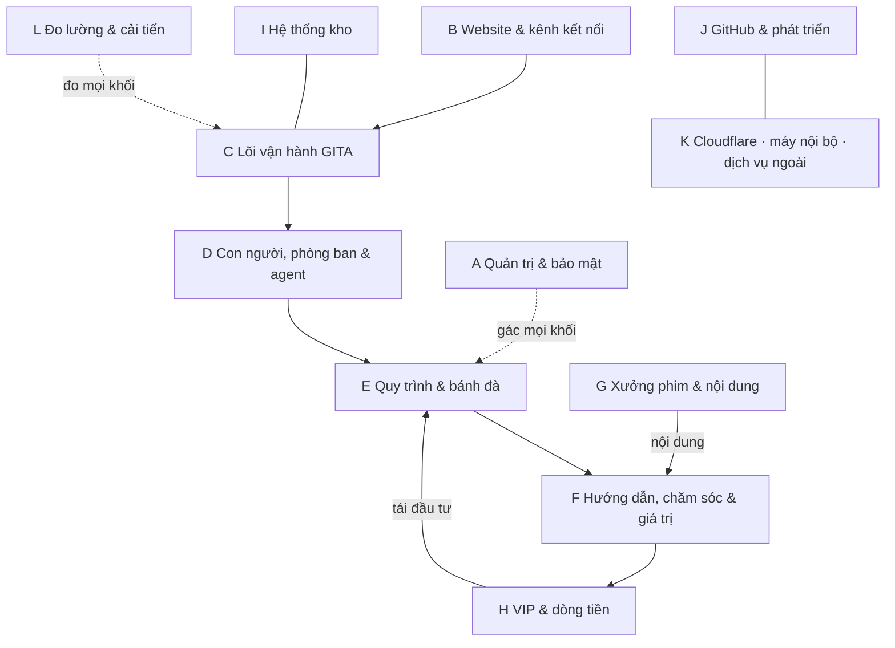

# Bản đồ tổng thể 12 khối A–L

> Màn `ban-do-tong-the` (quyền quản trị). Mỗi nút trỏ vào mã thật; CI đo mọi con trỏ trong `tools/do-16-he.js`. Nút chưa có ghi thật vào cột "Thiếu".

## Mười hai khối và cách chúng nối nhau

| Khối | Là gì | Trạng thái |
|---|---|---|
| A | Quản trị & bảo mật | Đã có: lá chắn 30 tầng · phân quyền R01–R20 · hiến pháp gác bằng mã · cổng Điều 13 |
| B | Website & kênh kết nối | Đã có: trang công khai + 3 không gian (quản trị/đội ngũ/khách). **Thiếu:** website 3D, quy kết kênh |
| C | Lõi vận hành | Đã có: điều phối agent · hồ sơ thống nhất · 5 tầng × 10 cấp · bộ não · ma trận đa tầng |
| D | Con người, phòng ban & agent | Đã có: 6 agent trưởng · 100 trợ lý · phòng ban · SOP bàn giao. **Thiếu:** bảng đo SLA chuyển tiếp |
| E | Quy trình & bánh đà | Đã có: quy trình chuẩn · 4 vòng bánh đà · 1000 chiến lược. **Thiếu:** chia 100 bánh đà nhỏ |
| F | Hướng dẫn, chăm sóc & giá trị | Đã có đủ 5 nút (điểm chạm WOW · tầng 1–2 · tầng 3–5 · thực hành · cấp giá trị) |
| G | Xưởng phim & nội dung | Đã có: đề xuất → duyệt → dựng → kiểm định → xuất. **Thiếu:** máy GPU render nội bộ |
| H | VIP & dòng tiền | Đã có: bảng giá · thu/hoàn · đối soát · cây tiền. **Thiếu:** cửa duyệt ngân sách tái đầu tư |
| I | Hệ thống kho | Đã có đủ 5 kho (danh mục · tài nguyên · tri thức · nhật ký · nghiệp vụ) |
| J | GitHub & phát triển | Đã có: CI 9 bước · deploy có cổng · soát bí mật. **Thiếu:** staging riêng |
| K | Cloudflare · máy nội bộ · dịch vụ ngoài | Đã có: Cloudflare đủ phần chạy · dịch vụ ngoài qua cổng ngoại lệ. **Thiếu:** máy render nội bộ |
| L | Đo lường & cải tiến | Đã có: audit · sổ token · hộp đen · vòng cải tiến · dashboard đa chiều |

## Bảy điểm thiếu ghi thật (đường đi tiếp theo)

1. Quy kết kênh marketing không theo dõi cá nhân (B1).
2. Website 3D thời gian thực (B2) — khi có đội làm riêng.
3. Bảng đo SLA chuyển tiếp giữa phòng ban (D5).
4. Chia 100 bánh đà nhỏ từ 4 vòng chính (E3) — khi mỗi vòng đã đo được riêng.
5. Máy GPU render nội bộ (G5/K2) — khi sản lượng phim đủ lớn.
6. Cửa duyệt ngân sách tái đầu tư (H5).
7. Môi trường staging (J3) — khi đội phát triển > 3 người.

## Trang trạng thái công khai

`trang-thai.html` (không cần đăng nhập) gọi cửa công khai `trangThaiCongKhai` (`may-chu/trang-thai.js`) — cửa DUY NHẤT không cần phiên, chỉ trả tổng hợp số (lần tự soát gần nhất · lượt phục vụ 0 token hôm nay · lượt ghi sổ hôm nay), không tên, không định danh ai. Phép thử: `node tools/thu-trang-thai.mjs` (7 phép, gồm trường hợp D1 hỏng vẫn không sập).
