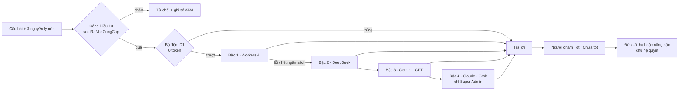

# Bộ não đa trí · Kho trí tuệ · Tảng băng giá trị

> Màn: `bo-nao-da-tri` · Máy chủ: `may-chu/bo-nao-da-tri.js` · Máy khách: `src/bo-nao-da-tri.js`
> Kiểm: `node tools/thu-da-tri.mjs` (20 phép) · `node tools/do-16-he.js` (con trỏ, mã, nguồn)

Chủ hệ yêu cầu ba điều. Mỗi điều được làm như sau:
- **Hệ tự vận hành và tiết kiệm từng token, với Claude, DeepSeek, ChatGPT, Grok và Gemini làm "bộ não".** Hệ dùng một bộ định tuyến đa nhà cung cấp, gọi bậc rẻ trước. Mọi lượt đều qua cổng Điều 13.
- **Trí tuệ từ 500.000 cuốn sách.** Đây là hướng mở rộng, không phải số đã có. Kho chứa nguyên lý viết lại, có nguồn và giới hạn.
- **Khách chỉ chạm 10% giá trị.** Phần này là tảng băng giá trị: mỗi lớp chìm trỏ vào cơ chế đang chạy thật, và được đo.

## 1. Bộ não đa trí

| Bậc | Nhà cung cấp | Biến khoá | Mô hình mặc định | Ai được dùng |
|---|---|---|---|---|
| 0 | Bộ đệm D1 | — | — | Mọi người nhà R01–R12 |
| 1 | Cloudflare Workers AI | binding `[ai]` | `@cf/meta/llama-3.1-8b-instruct` (biến `GITA_MAU_CF`) | R01–R12 |
| 2 | DeepSeek | `GITA_KHOA_DEEPSEEK` | `deepseek-chat` | R01–R12 |
| 3 | Gemini | `GITA_KHOA_GEMINI` | `gemini-2.5-flash` | R01–R12 |
| 3 | ChatGPT | `GITA_KHOA_OPENAI` | `gpt-4o-mini` | R01–R12 |
| 4 | Claude | `GITA_KHOA_ANTHROPIC` | **bắt buộc khai** qua `GITA_MAU_ANTHROPIC` | R01 |
| 4 | Grok | `GITA_KHOA_XAI` | **bắt buộc khai** qua `GITA_MAU_XAI` | R01 |

Mô hình của Claude và Grok không được đoán: tên mô hình đổi theo thời gian, và đoán sai sẽ làm hỏng lượt gọi. Chủ hệ tự khai tên.

**Loại việc.** Mỗi loại việc có khoảng bậc riêng, trần token ra, trần ký tự vào và thời gian giữ đệm:

| Loại việc | Khoảng bậc | Trần token ra | Giữ đệm | Ai dùng |
|---|---|---|---|---|
| Phân loại | 1–2 | 200 | 30 ngày | R01–R12 |
| Tóm tắt | 1–3 | 400 | 7 ngày | R01–R12 |
| Soạn nháp | 1–3 | 1000 | 1 ngày | R01–R12 |
| Phân tích sâu | 2–4 | 1500 | 1 ngày | R01–R12 |
| Chiến lược cấp hệ | 3–4 | 2000 | 1 ngày | Chỉ R01 |

**Hội đồng đa trí** (chỉ R01) hỏi tối đa 3 nhà cung cấp khác nhau cùng một câu, rồi đặt các câu trả lời cạnh nhau. Hệ cố ý không gộp chúng lại: chỗ các mô hình bất đồng là chỗ người cần quyết.

### Bảy đòn tối ưu token

1. **Bộ đệm:** câu đã hỏi được trả lại với 0 token. Khoá đệm là SHA-256 của loại việc, câu hỏi đã chuẩn hoá và tri thức kèm theo. Khi người dùng chấm "chưa tốt", ô đệm đó bị xoá.
2. **Rẻ trước:** một bậc chỉ được gọi khi bậc dưới lỗi hoặc hết ngân sách, hoặc khi người dùng chủ động bấm "Lên bậc".
3. **Trần token ra** theo loại việc, từ 200 đến 2000.
4. **Lời hệ thống ngắn**, vì nó được gửi lại ở mỗi lượt.
5. **Tri thức gửi ở dạng nén:** chỉ 3 nguyên lý liên quan nhất, tối đa 800 ký tự.
6. **Ngân sách token mỗi ngày** cho từng nhà cung cấp, đặt bằng các biến `GITA_NGAN_TOKEN_*`. Hết ngân sách thì hệ leo bậc hoặc dừng.
7. **Chế độ tiết kiệm** (`GITA_CHE_DO_TIET_KIEM=1`): chỉ còn bộ đệm và Workers AI; hội đồng tạm nghỉ.

Ngoài ra, mỗi người có số lượt tối đa trong ngày: R01 được 200 lượt, người nhà khác được 60 lượt. Giới hạn này chống hoá đơn bất ngờ.

### Chi phí

Workers AI miễn phí 10.000 neuron mỗi ngày, nên ở giai đoạn 0đ chỉ bật bậc 0 và bậc 1. Khi bước sang giai đoạn ≤ 20 USD/tháng:
- bật DeepSeek với ngân sách ngày nhỏ;
- **mỗi đồng chi phải nhìn thấy được** ở thẻ "Tối ưu token": số token, số lượt và tỉ lệ trúng đệm theo ngày.

Hệ không cam kết một con số tiết kiệm. Tỉ lệ trúng đệm đo được mới là con số thật.

### Tự tối ưu: máy đề xuất, chủ hệ quyết

Thẻ "Tối ưu token" đọc điểm chấm thật và đề xuất theo hai quy tắc:
- **Đề xuất hạ trần:** khi một nhà cung cấp ở bậc rẻ hơn trần đạt ≥ 80% "tốt" qua ≥ 5 lượt chấm.
- **Đề xuất nâng bậc khởi đầu:** khi một nhà cung cấp bị chê quá 50% qua ≥ 5 lượt chấm.

Máy không tự sửa cấu hình. Cổng nhiều nhà cung cấp là vùng đỏ AT5, nên chủ hệ quyết.

### Bật lên (chủ hệ)

1. Mở `may-chu/wrangler.toml`. Đặt `GITA_DA_TRI_BAT = "1"` và bỏ dấu chú thích ở khối `[ai] binding = "AI"`.
2. Thêm khoá bằng lệnh `wrangler secret put GITA_KHOA_DEEPSEEK`. Làm tương tự cho `GEMINI`, `OPENAI`, `ANTHROPIC` và `XAI` — chỉ những khoá muốn dùng.
3. Nếu dùng Claude hoặc Grok, khai tên mô hình qua `GITA_MAU_ANTHROPIC` và `GITA_MAU_XAI`.
4. Đặt ngân sách ngày, ví dụ `GITA_NGAN_TOKEN_DEEPSEEK = "200000"`.
5. Chạy `wrangler deploy`. Vào màn **Bộ não đa trí** và xem cột "Sẵn sàng".

## 2. Kho trí tuệ

- **Không chép toàn văn sách còn bản quyền.** Mỗi mục gồm:
  - nguyên lý viết lại bằng lời của GITA;
  - nguồn theo dạng `Tác giả — Sách`;
  - giới hạn: chỗ không được dùng nguyên lý đó.
- **Số hiển thị là số đếm thật.** Hiện kho gồm:
  - 42 nguyên lý mới, chia 10 miền;
  - G.BAIHOC (màn `tu-duy`);
  - G.SACH (màn `sach`, chỉ có khi vai được cấp gói nghề).
- **"500.000 cuốn" là hướng, không phải khẳng định.** Kho mở rộng qua đường duyệt tài liệu đã có (màn `duyet-tai-lieu`), không qua cửa sau.
- **Tìm kiếm chạy trên máy khách** và bỏ dấu tiếng Việt, hợp với dữ liệu mã hoá đầu cuối. Ba nguyên lý khớp nhất được gửi kèm câu hỏi AI ở dạng nén.
- **CI kiểm:**
  - mã nguyên lý không trùng;
  - mỗi mục có nguồn và giới hạn;
  - mỗi miền trỏ vào một màn có thật.

## 3. Tảng băng giá trị

- **Phần nổi (khoảng 10%)** là những gì gia đình chạm vào: việc hôm nay, lộ trình, thẻ vùng mạnh, coach, hành trình 5 tầng.
- **Phần chìm (90%)** gồm 10 lớp. Mỗi lớp trỏ `v:`/`g:` vào cơ chế đang chạy; CI chặn khi một con trỏ chết.

**Hành trình gắn bó** đi qua 5 chặng: Chạm → Hiểu → Làm → Thành → Lan toả. Mỗi chặng ghi rõ:
- khách thấy gì;
- mở thêm phần nào;
- đo bằng gì;
- gắn bó nhờ đâu;
- điều **CẤM**: ép mua buổi đầu, dán nhãn "yếu", phạt mất chuỗi, xếp hạng giữa các gia đình, thưởng giới thiệu ép chia sẻ.

Khách muốn quay lại vì thấy con mình tiến bộ, không vì sợ mất. Luật đạo đức tiếp thị: `CWOW_LUAT` (màn `chuoi-wow`).

## Sửa kèm

Hàm `ghiSo` trong `may-chu/an-toan-ai.js` từng ghi vào cột `audit.boiAi`, nhưng cột này không tồn tại. Lỗi bị nuốt, nên **không lượt ATAI nào từng được ghi sổ**. Hàm nay ghi qua `Kho.ghiNhatKy`. `thu-da-tri.mjs` kiểm rằng mọi lượt, kể cả lượt bị chặn theo Điều 13, đều để lại vết trong sổ.
