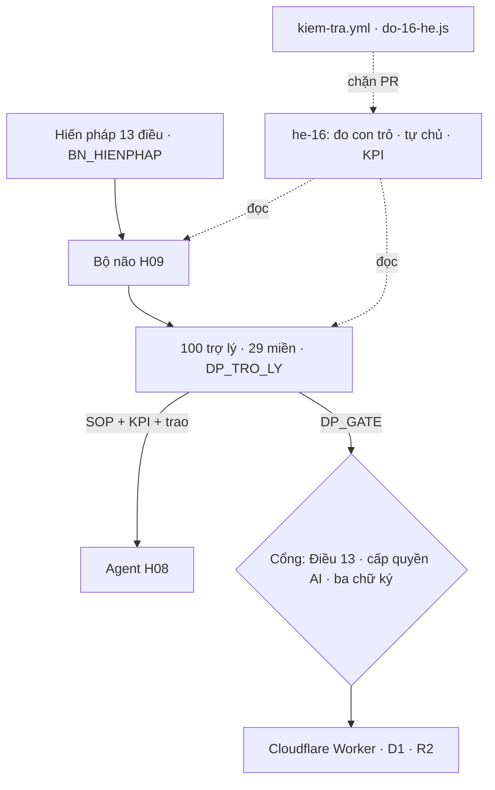

# GITA365 — 16 hệ thống kiện toàn sâu

> Màn `he-16` (src/he-16.js) · cổng CI `tools/do-16-he.js` · luôn **đo, không khai**.
> Không dựng hiến pháp/cổng/roster thứ hai: mọi hệ **trỏ** vào cơ chế đang chạy
> (`BN_HIENPHAP`, `DP_TRO_LY`, `DP_GATE`…) — luật 9.99.83.

## 1. Bản đồ 16 hệ

| Mã | Hệ | Nguồn sự thật |
|---|---|---|
| H01 | Quản trị | quyền vai trò, cấp quyền AI, ba chữ ký |
| H02 | Dữ liệu · thông tin | D1 + R2 + đồng bộ etag, ngăn khoang, tự lành |
| H03 | Vận hành nội lực | khoang.js, cầu dao, agent tự lành |
| H04 | Khách hàng | hồ sơ, đồng hành, CSKH |
| H05 | Tài chính | sổ quỹ, đối soát, chi phí 0/20/50 |
| H06 | Marketing | phễu, phim cầu nối, xưởng phim |
| H07 | Văn bản · pháp lý · hiến pháp | Hiến pháp 13 điều (`bo-nao.js`) |
| H08 | Agent | 100 trợ lý `DP_TRO_LY`, 29 miền |
| H09 | Bộ não vận hành trung tâm | `BN_*`, sổ lệnh |
| H10 | Main tự chủ | thang tự chủ TC0–TC5 |
| H11 | Thuê ngoài · đối tác | cửa đối tác, webhook |
| H12 | Giải pháp | khuôn `H16_GP` |
| H13 | R&D · X10 · chu kỳ 6 tháng | `H16_RD`, mốc nền |
| H14 | 1000 chiến lược | `H16_CL` + ICE |
| H15 | Quản trị mã nguồn · mã định dạng | CI, CODEOWNERS, `H16_MA` |
| H16 | Chi phí · sức chứa | `TOI_UU_CHI_PHI_CHAT_LUONG.md` |

Mỗi hệ có `troVao` (con trỏ `v:` màn · `g:` biến · `f:` cửa Worker · `d:` tài liệu ·
`t:` công cụ), `trong` (khoảng trống thật) và `ke` (bước kế). CI hỏng nếu một con
trỏ chết.

## 2. "100% AI tự vận hành" — nói thật bằng số đo

AI **tham gia** 100% cửa, nhưng **tự chạy trọn** chỉ ở đâu hiến pháp cho phép:

| Bậc | Nghĩa | Trần theo hồ sơ cửa |
|---|---|---|
| TC0–TC1 | Người làm · AI gợi ý | — |
| TC2 | AI soạn, người ký | `tien`, `con` (tiền, trẻ em) |
| TC3 | AI làm, người duyệt mẫu / ba chữ ký | `duyet3`, `ngoai` |
| TC4 | AI tự chạy trọn, có nhật ký + hoàn tác | `chung` |
| TC5 | AI tự đổi luật | **không bao giờ mở** cho tiền, trẻ em, khách hàng |

Số đo hiện tại (`node tools/do-16-he.js`): TC4 = 27 cửa, TC3 = 24, TC2 = 49 / 100.
Điểm khác biệt so với đối thủ coach / người + AI **không phải "AI làm hết"** mà là
**chứng minh được** AI làm tới đâu và người ký ở đâu. Mọi con số định giá
(ví dụ 500 triệu USD) mã nguồn không kiểm chứng được — chỉ là hướng.

## 3. Agent — chuẩn 8 năng lực

VT vai trò · NV nghiệp vụ · QT quy trình (SOP) · KPI · TW teamwork (trao miền) ·
NC tự nâng cấp (qua vòng nâng cấp có cổng) · BV tự bảo vệ (`DP_GATE`) · HP hiến pháp.
29 SOP (`H16_SOP`), mỗi SOP chỉ nối các cửa **của chính miền đó** — CI kiểm.
KPI đọc thật từ nhật ký qua `soatHoatDongAgent`.

## 4. 1000 chiến lược

10 mục tiêu (M0–M9) × 10 đòn bẩy (L0–L9) × 10 phạm vi (S0–S9) → mã `CL-mls`
tất định. Chấm ICE (Impact · Confidence · Ease) tại máy; chiến lược chỉ "chứng"
khi có bằng chứng đo được gắn kèm.

## 5. R&D chu kỳ 6 tháng · X10

Tháng 0 chụp **mốc nền** (`h16ChupMoc`), tháng 1–5 thử nghiệm, tháng 6 so
tỉ số chỉ số thật / mốc nền. X10 là **hướng**, không lưu con số tự khai (DP5).

## 6. Mã định dạng & quản trị mã nguồn

- `H16_MA`: mẫu regex cho mã hệ, trợ lý, chiến lược, giải pháp — CI kiểm dữ liệu thật.
- Commit theo Conventional Commits (`feat|fix|docs|chore(phạm-vi): …`); bật
  release-please khi đã quen.
- CI: `kiem-tra.yml` (gộp src · cú pháp Worker · rà soát · CORS · đồng bộ giả lập ·
  đo 16 hệ), `codeql.yml`, `scorecard.yml`, `dependabot.yml`, `CODEOWNERS`,
  mẫu PR.

## 7. Repo GitHub đã phán quyết (29)

| Phán quyết | Repo / dịch vụ |
|---|---|
| Gốc Cloudflare · bật 0đ | D1 Time Travel · Workers AI · Workflows · Vectorize · Web Analytics |
| CI (đã bật) | CodeQL · OpenSSF Scorecard · Dependabot · (sau) release-please |
| Phụ thuộc nhỏ, đợt kế | minisearch (cần thử tách từ tiếng Việt) · json-rules-engine · cloudflare/agents · valibot · graphology |
| Học mẫu | CASL · OPA · openai-agents-js · crewAI · guardrails · xstate · cockatiel · yjs · standard-webhooks · OpenFeature |
| Tự chạy trên Windows | restic (sao lưu R2 → máy, 0đ) |
| **Không tích hợp** | twenty, bigcapital, Unleash v8+ (AGPL) · nodemailer (cần TCP) |

Repo GITA365 dùng giấy phép riêng: không chép mã AGPL.

## 8. Lộ trình

1. Bật D1 Time Travel, Web Analytics (0đ, chỉ cấu hình).
2. Thử minisearch với chuẩn hoá bỏ dấu tiếng Việt cho tìm kiếm E2EE phía máy.
3. Workers AI cho trợ lý TC4; Workflows cho sổ lệnh Bộ não dài hơi.
4. Chụp mốc nền R&D tháng 0; ghi 10 ca giải pháp đầu.
5. Bật release-please khi commit đã theo quy ước.

## Tiếp nối

- [Bộ não đa trí · Kho trí tuệ · Tảng băng giá trị](BO_NAO_DA_TRI.md) — hiện thực H08 (Agent), H09 (Bộ não), H04 (Khách hàng), H16 (Chi phí) cho năm họ AI, nguyên lý từ sách kinh điển và hành trình gắn bó có đạo đức.
