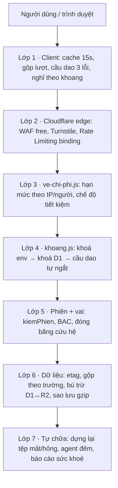

# KIẾN TRÚC NỘI LỰC — GITA 365

> An toàn, êm, khoá được từng phần, tự chữa sau sự cố. Tự sản xuất, tự vận hành, tự nâng cấp trên **GitHub + Cloudflare + Windows 11 Pro**.
> Chi phí nền tảng: **0đ dưới 300k tài khoản · ≤ 20 USD/tháng từ 300k–500k · ≤ 50 USD/tháng trên 500k.**

Tài liệu này đi tiếp [TOI_UU_CHI_PHI_CHAT_LUONG.md](TOI_UU_CHI_PHI_CHAT_LUONG.md) (năm điểm yếu đã khắc phục). Mỗi mục ghi rõ: **đã có trong mã**, **mới làm đợt này**, hoặc **lộ trình**.

---

## 0. Nói thẳng về "mạnh gấp 10 lần" và "100.000 điểm chạm WOW"

- **"Gấp 10 lần"** không phải một con số đo được nếu không chọn trước chỉ số. Ở đây ta đo bằng 5 chỉ số cụ thể, mỗi chỉ số có mốc trước/sau. Xem mục 1.
- **"100.000 điểm chạm WOW"** theo luật đã chốt (`G.CWOW_LUAT`, SUP-01) là **cách đếm**, không phải chỉ tiêu: 10 tầng × 10.000 biến thể (câu gốc × trạng thái × thời khắc × ngôn ngữ). Ma trận "xoáy" nhiều lớp là cách **sinh** biến thể từ ít lõi thật. Đó là 5 tầng × 10 cấp × 8 hồi × 5 giọng chuyên gia × ngữ cảnh. Không đặt đích "đủ 100.000", vì đặt đích là mời người làm cho đủ số.

## 1. Năm chỉ số "gấp 10"

| Chỉ số | Trước | Sau đợt này | Cách đạt |
|---|---|---|---|
| Phạm vi ảnh hưởng của một sự cố | Cả hệ (đóng băng tất cả hoặc không) | **1/12 hệ**: một khoang | `may-chu/khoang.js` |
| Thời gian khoá một phần khi bị tấn công | Sửa mã + deploy (~10 phút) | **< 30 giây** (một nút, hoặc một biến môi trường) | khoang: lớp env, D1, nút admin |
| Hồ sơ hỏng hoặc mất tệp R2 | Lỗi 500, cần người chữa tay | **Tự dựng lại ngay trong lượt đồng bộ** + soát hằng đêm | `khoiPhucTuSaoLuu`, `tu-chua.js` |
| Vòng lỗi lặp làm cháy hạn mức | Chạy tới khi hết 100k lượt/ngày | **Tự ngắt sau 8 lỗi/60 giây** từng khoang (60s → 10 phút) | cầu dao khoang + cầu dao client |
| Deploy hỏng thay bản đang chạy | Có thể | **Không**: cổng kiểm trước deploy | `.github/workflows/deploy.yml` |

---

## 2. Kiến trúc bảy lớp phòng thủ



### 2.1 Khoang: khoá được TỪNG PHẦN (mới)

Mọi việc (`fn`) được xếp vào 12 khoang: `cuuhe, cua, dongbo, ai, phim, crm, taichinh, thigiac, congdong, noidung, taikhoan, khac`. Có ba lớp khoá, lớp nào chặn trước thì chặn:

1. **Biến môi trường** `GITA_KHOA_KHOANG="ai,phim"`. Dùng được ngay cả khi D1 hỏng hoặc không ai đăng nhập được. `*` khoá mọi khoang trừ đăng nhập và cứu hệ.
2. **Bảng D1 `heKhoang`**. Super Admin/Admin bấm *Khoá/Mở* ở màn **Nối máy chủ → Khoang hệ thống & sức khoẻ**. Có lý do, thời hạn tự mở và nhật ký. Mỗi isolate đọc bảng này tối đa 30 giây/lần.
3. **Cầu dao tự ngắt** trong từng isolate: 8 lỗi/60 giây thì nghỉ 60 giây. Mỗi lần ngắt lại thì gấp đôi thời gian nghỉ, tối đa 10 phút.

Khoang `cua` (đăng nhập) và `cuuhe` không bao giờ khoá được từ trong app, để không tự nhốt mình ở ngoài. Client nhận `KHOANG_KHOA`/`KHOANG_NGHI` thì **chỉ nghỉ đúng việc ấy**; phần còn lại vẫn chạy.

### 2.2 Tự chữa dựa trên kho dữ liệu (mới)

- **Ngay trong lượt đồng bộ**: tệp `hoso/<uid>.json` hỏng JSON thì cất bản hỏng sang `hoso-hong/` để điều tra, rồi dựng lại từ 5 bản sao lưu gần nhất (gunzip, kiểm JSON). Tệp mất mà D1 nói từng có dữ liệu thì cũng dựng lại. Người dùng không thấy lỗi.
- **Agent đêm** `tuSoatVaChua` (cron):
  - Nhịp tim D1 và R2.
  - Soát 200 hồ sơ/đêm theo con trỏ cuốn chiếu, dựng lại tệp mất.
  - Mở các khoang đã hết hạn khoá.
  - Ghi `he-thong/suc-khoe.json` và `console.error('SUC_KHOE_HE')` khi có vấn đề.
  - Admin xem báo cáo trong app.
- Giới hạn trung thực: 200 hồ sơ/đêm là để ở trong hạn lượt gọi dịch vụ của một lần cron. Lưới chính là **tự chữa ngay trong lượt đồng bộ**; agent đêm là lưới thứ hai cho người lâu không mở app.

### 2.3 Khôi phục sau thảm hoạ (lộ trình, 0đ)

| Rủi ro | Cách khôi phục | Chi phí |
|---|---|---|
| Xoá nhầm / ghi hỏng D1 | **D1 Time Travel**: `wrangler d1 time-travel restore gita365 --timestamp=…` (7 ngày Free, 30 ngày Paid) | 0 |
| Hỏng nhiều hồ sơ R2 | Bản sao lưu gzip trong `hoso-sao/` + tự chữa | 0 |
| Mất tài khoản Cloudflare / bị chiếm | **Bản sao offline trên Windows 11 Pro** (bên dưới) | 0 |
| Worker sập | Bản tĩnh vẫn chạy ở GitHub Pages (job `github-pages`), dữ liệu cục bộ còn nguyên | 0 |
| Deploy hỏng | Cổng kiểm + `wrangler rollback` | 0 |

**Sao lưu offline hằng đêm trên Windows 11 Pro** (Task Scheduler, ổ có BitLocker):

```powershell
# C:\GITA\sao-luu.ps1 — chạy 02:30 mỗi đêm, tài khoản Windows riêng, không phải admin
$ngay = Get-Date -Format yyyyMMdd
$dich = "D:\GITA-SAO-LUU\$ngay"; New-Item -ItemType Directory -Force $dich | Out-Null
npx wrangler d1 export gita365 --remote --output "$dich\gita365.sql"
# R2: dùng rclone (S3 API của R2, khoá API chỉ-đọc) để sao gia tăng
rclone sync r2:gita365-hoso "D:\GITA-SAO-LUU\r2" --fast-list
Get-ChildItem D:\GITA-SAO-LUU -Directory | Where-Object Name -match '^\d{8}$' |
  Sort-Object Name -Descending | Select-Object -Skip 30 | Remove-Item -Recurse -Force
```

- Khoá API R2 cho rclone chỉ nên có quyền **Object Read**.
- Token wrangler cho máy sao lưu chỉ nên có quyền **D1 Read**.
- Bật BitLocker cho ổ D:. Mỗi quý thử khôi phục một lần vào D1 thử (`wrangler d1 create gita365-thu`).

---

## 3. Lộ trình: Bổ sung · Cải tiến · Nâng cấp · Tinh gọn

### Bổ sung (đã làm đợt này)
- `may-chu/khoang.js`: 12 khoang, 3 lớp khoá, cầu dao. Thêm bảng `heKhoang` trong `csdl.sql`. Máy chủ tự tạo bảng nếu thiếu.
- `may-chu/tu-chua.js` + `khoiPhucTuSaoLuu` trong `dong-bo.js`: tự chữa hồ sơ, agent đêm, báo cáo sức khoẻ.
- Màn admin **Khoang hệ thống & sức khoẻ** (`src/noi-may-chu.js`), cùng xử lý nghỉ theo việc ở client.
- **Phim cầu nối cấp độ** (`src/phim-cau-noi.js`): 50 kịch bản. Xem mục 5.
- Biến `GITA_GIU_SAO_LUU`, `GITA_SAO_LUU_PHUT`: đòn bẩy giữ 0đ tới 300k.
- Cổng kiểm trong `deploy.yml` trước khi deploy Worker.

### Cải tiến (lộ trình gần, 0đ)
1. **GitHub**:
   - Branch protection cho `main` (bắt buộc PR + cổng kiểm xanh).
   - Bật Dependabot alerts, Secret scanning + Push protection, CodeQL (miễn phí với repo public; repo private cần GitHub Advanced Security).
   - Thêm `CODEOWNERS` cho `may-chu/` và `.github/`.
2. **Cloudflare free**:
   - WAF Custom Rules (5 luật free): chặn ngoài phương thức GET/POST/OPTIONS, chặn body > 1 MB ở Worker, chặn quốc gia không phục vụ nếu muốn.
   - Bật **Bot Fight Mode**.
   - **Turnstile** (miễn phí) cho đăng ký và quên mật khẩu.
3. **Rate Limiting binding** `GIOI_HAN` (đã có khung trong `wrangler.toml`): bật khi có dấu hiệu dò quét.
4. **Workers Logs** (free có hạn mức): lọc theo `x-gita-ma`, `KHOANG_TU_NGAT`, `SUC_KHOE_HE`.

### Nâng cấp (khi sang gói Paid, quanh 300k)
- Thông báo sức khoẻ chủ động: cron đọc `suc-khoe.json`, có vấn đề thì gửi qua cầu nối Gmail đã có.
- D1 Time Travel 30 ngày.
- Tách việc phim/AI nặng sang **Queues** nếu tỉ lệ lỗi ở khoang `phim` cao.
- Khoá cấu hình khoang theo vai chi tiết hơn (Admin chỉ khoá được khoang nghiệp vụ, Super Admin khoá được tất cả).

### Tinh gọn (để giữ ≤ 50 USD trên 1,5M tài khoản)
- R2 lớp A là dòng chi lớn nhất: gom ghi hồ sơ theo **lô 10 phút** ở client (đã có), nâng `GITA_SAO_LUU_PHUT` lên 10080 (7 ngày).
- Bỏ đọc D1 `heKhoang` trên đường nóng, thay bằng chỉ biến môi trường (giảm đọc D1 khi tải lớn).
- Gỡ các nhánh gọi trùng trong bốn chỗ fetch cũ (xem ghi chú ở `G.goiMayChu`) để mọi lượt đều đi qua một cửa có cache và cầu dao.

---

## 4. Nội lực: tự sản xuất, tự vận hành, tự nâng cấp

| Năng lực | Công cụ | Ai làm |
|---|---|---|
| Tự sản xuất nội dung | Xưởng phim bộ + **Phim cầu nối** + kho 50 cấp | Đội nội dung, Super Admin duyệt |
| Tự vận hành | Khoang + agent tự chữa + báo cáo sức khoẻ + sổ tay ở TOI_UU_CHI_PHI_CHAT_LUONG.md | Admin trực |
| Tự nâng cấp an toàn | PR → cổng kiểm → deploy; lỗi thì `wrangler rollback`; bản GitHub Pages là phao | Kỹ thuật |
| Tự khôi phục | D1 Time Travel + sao lưu Windows + tự chữa R2 | Admin + máy |

**Sổ tay sự cố 5 bước**:
1. Nhìn **Báo cáo tự chữa** và Workers Metrics.
2. Khoá đúng khoang có vấn đề (nút, hoặc `GITA_KHOA_KHOANG`).
3. Bật `GITA_CHE_DO_TIET_KIEM=1` nếu chi phí AI tăng.
4. Lấy `x-gita-ma` từ người dùng và chạy `wrangler tail`.
5. Sửa, PR, cổng kiểm, deploy rồi mở khoang. Mọi bước đều có nhật ký.

---

## 5. Phim cầu nối cấp độ: giá trị nhân văn trong 50 khoảnh khắc

Màn **Phim cầu nối cấp độ** (nhóm Nghề, quyền `pro_consult`) sinh kịch bản cho từng cấp trong 50 cấp (`G.KTL_CAP50`), gồm 8 hồi, khoảng 76 giây:

| Hồi | Giọng dẫn | Việc |
|---|---|---|
| 1. Nhìn lại | Content marketing | Gọi lại hình ảnh cấp trước (callback) |
| 2. Ghi nhận | Nhà tâm lý | Gọi tên nỗ lực và cảm xúc đã qua |
| 3. Ngưỡng cửa / Bước qua cửa tầng | Coach | Danh tính mới: "Từ hôm nay, mình là…" |
| 4. Không gian của cấp mới | Tư vấn | Không gian, hình ảnh, âm thanh mẫu theo ẩn dụ HẠT→RỄ→THÂN→TÁN→RỪNG |
| 5. Hành động nhỏ đầu tiên | Tư vấn | Một việc ≤ 60 giây (lấy `hn.nhiemVu` từ kho nếu đã mở khoá) |
| 6. Có người đi cùng | Chăm sóc khách hàng | Trấn an, có quyền dừng nghỉ |
| 7. Hé lộ phía trước | Content marketing | Vòng mở về cấp sau, **không thúc** |
| 8. Lời hẹn | Coach | "Hẹn mình ngày mai — cùng một phút ấy." |

- Khi sang tầng mới, cấp x.10 sang (x+1).1 thành **phim chuyển tầng**, có biểu tượng chuyển hoá.
- Cấp cuối 5.10 khép vòng: câu chuyện của mình trở thành buổi đầu của người khác.
- Mỗi kịch bản qua **bộ soát đạo đức** `G.pcnSoatDaoDuc` (cấm "chỉ còn", "kẻo lỡ", "chia sẻ ngay"…), đúng luật `CWOW_LUAT`.
- Nút **Gửi sang Xưởng phim bộ** đưa kịch bản vào ghi chú khách hàng để dựng phim thật.
- Không gian và hành động là **mẫu đề xuất**; chủ hệ chốt. Phần lấy từ kho được gắn nhãn "lời từ kho".

## 16 hệ thống · thang tự chủ AI

Xem [HE_16_TRU.md](HE_16_TRU.md): bản đồ 16 hệ trỏ vào cơ chế thật, thang tự chủ TC0–TC5, Agent 8 năng lực, 1000 chiến lược, R&D 6 tháng, kho repo đã phán quyết. Cổng CI: `node tools/do-16-he.js`.
