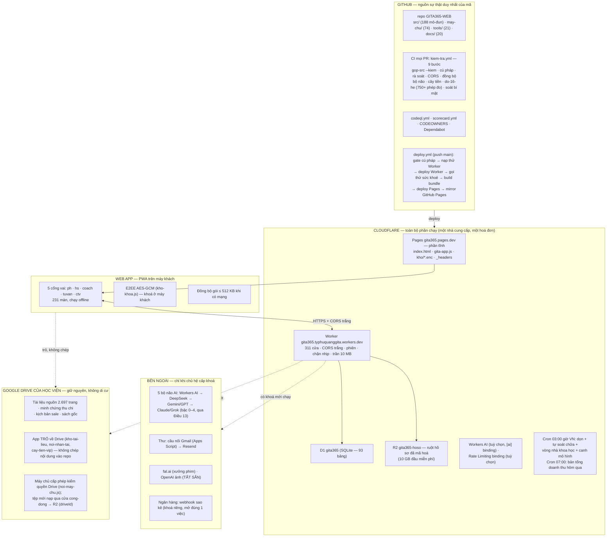

# Kiến trúc tổng thể GITA365 — bản as-built (đo từ repo, không khai)

> Rà soát 4 nguồn thật: kho GitHub · cấu hình Cloudflare (`may-chu/wrangler.toml` + workflow `deploy.yml`) · web app PWA · kho Google Drive của Học viện. Mọi con số dưới đây đếm từ mã: **188 mô-đun `src/` · 231 màn · 74 mô-đun `may-chu/` · 311 cửa Worker · 93 bảng D1 · 21 công cụ CI**. Sơ đồ vận hành chi tiết (vòng đời yêu cầu, vòng đêm, CI/CD): [SO_DO_VAN_HANH_TONG_THE.md](SO_DO_VAN_HANH_TONG_THE.md).

## 1. Một hình dung toàn cảnh

## 2. Bốn nguồn, vai trò từng nguồn

| Nguồn | Giữ gì | Vì sao |
|---|---|---|
| **GitHub** | Toàn bộ mã + CI 9 bước + deploy | Nguồn sự thật duy nhất; mọi thay đổi qua PR có cổng đo |
| **Cloudflare** | Toàn bộ phần chạy: Pages (tĩnh) + Worker (311 cửa) + D1 (93 bảng) + R2 (ruột hồ sơ) + cron 2 nhịp | Không trần 30 lượt đồng thời của Apps Script; D1 là SQLite nên bộ thử chạy cùng một cỗ máy; Pages cùng tên miền nên không CORS |
| **Web app (PWA)** | 231 màn, 5 cổng vai, E2EE, chạy offline | Khoá giải mã ở máy khách — máy chủ chỉ giữ bản đã mã hoá |
| **Google Drive** | Tài liệu nguồn, minh chứng, sách gốc, kịch bản | Đã ở đó, chủ hệ đã quen thao tác; chuyển đi không đổi con số nào trong bản đo — chuyển thứ đang chạy tốt là mua rủi ro |

## 3. Vai trò từng khối trong Worker (74 mô-đun `may-chu/`)

- **Nền:** `nen.js` (PBKDF2, phiên, Kho.*) · `vai-tro.js` (R01–R20) · `an-toan.js` · `khoang.js` (cầu dao từng phần) · `ve-chi-phi.js` (chặn nhịp, trần tải) · `cuu-he.js` (đóng băng sự cố) · `tu-chua.js` (tự lành đêm).
- **Trí tuệ:** `bo-nao-da-tri.js` (V20: định tuyến bậc 0–4, kho giải pháp 0 token, hội đồng, cố vấn, tuyến chốt chặn, vòng nhà khoa học) · `an-toan-ai.js` (cổng Điều 13) · `bo-nao.js` · `dieu-phoi.js` (100 trợ lý) · `khung-van-hanh.js` (bộ chấm 5 trụ).
- **Nghiệp vụ:** tài chính (`tai-chinh.js` · `ke-toan.js` · `ngan-hang.js` · `luong.js` · `cay-tien.js`) · CRM (`crm*.js` · `van-hanh-cham-soc.js` · `vip-care.js`) · nội dung (`noi-dung-tiep-thi.js` · `studio.js` · `phim-ai.js` · `cong-dong.js`) · pháp lý (`phap-ly-rui-ro.js` · `chung-cu.js`) · thanh tra (`thanh-tra.js` · `giam-sat.js`).
- **Cầu nối:** `thu.js` (Resend/Gmail bridge) · `cau-noi-gmail/` (Apps Script) · `ngan-hang.js` (webhook sao kê).

## 4. Nguyên tắc kiến trúc đang chạy (rút ra từ mã, không phải khẩu hiệu)

1. **Một cửa vào, một nguồn sự thật:** mọi yêu cầu qua `worker.js` fetch; mọi thay đổi mã qua PR có CI.
2. **Đo, không khai:** 750+ phép đo CI mỗi PR; KPI cây tiền tính lúc đọc từ D1; "V20" là các trụ có răng, không phải con số tự xưng.
3. **Rẻ trước, 0đ mặc định:** kho giải pháp + đệm D1 trả 0 token; AI bậc cao chỉ khi cần và có ngân sách; trần tải 50% không bao giờ chạm đáy hạn mức.
4. **Máy đề xuất, người quyết (AT5):** cố vấn chỉ khuyên, vòng nhà khoa học chỉ báo, tuyến chốt chặn dừng chờ người.
5. **Không bí mật trong repo:** 4+ secret nạp bằng `wrangler secret` / GitHub Actions; CI có bước soát bí mật.
6. **Bản sao kép:** Pages + GitHub Pages mirror; sao lưu R2 theo người; điểm khôi phục kiểm bằng `thu-dong-bo.mjs`.
7. **Đổi nền đổi ngược được trong một phút:** cửa vào mới giữ nguyên bề mặt máy chủ cũ.

## 5. Chỗ còn thiếu / rủi ro (ghi thật)

1. Workers AI binding và Rate Limiting binding **đang để dạng khai nhưng chưa bật** (bỏ dấu # khi cần).
2. Gửi thư đang qua **cầu nối Gmail ~100 người nhận/ngày** — đủ giai đoạn đầu, phải sang Resend + tên miền riêng trước khi vượt vài nghìn tài khoản hoạt động.
3. Drive phụ thuộc tài khoản Google của Học viện — chưa có phương án dự phòng nếu tài khoản đó mất quyền.
4. Pentest độc lập, WAF/Bot Fight Mode (bật tay trên Cloudflare), diễn tập khôi phục định kỳ — xem [LA_CHAN_30_TANG.md](LA_CHAN_30_TANG.md).
5. Khảo sát hài lòng trực tiếp (CSAT) chưa có — KPI "hài lòng" đang là proxy.

## 6. Hợp nhất với mô hình mục tiêu chuẩn doanh nghiệp

Sơ đồ mô hình chuẩn (Hiến pháp OPA/Rego · Bộ não LangGraph/Letta · 6 Agent · Twenty/ERPNext/Mautic/Documenso · Vectorize/Langfuse/Zero Trust · Cloudflare đủ loại) đã được HỢP NHẤT với mã đang chạy ở màn `kien-truc-hop-nhat`: mỗi mảnh mang một trong ba trạng thái — ĐÃ CÓ (trỏ mã thật, CI đo) · TỰ XÂY TƯƠNG ĐƯƠNG · CHƯA — kèm ngưỡng kích hoạt đo được. Không nhập một mảnh vì nó đẹp trên hình; một mảnh chỉ vào khi chạm ngưỡng, và mọi mảnh đổi được mà không sập hệ.
