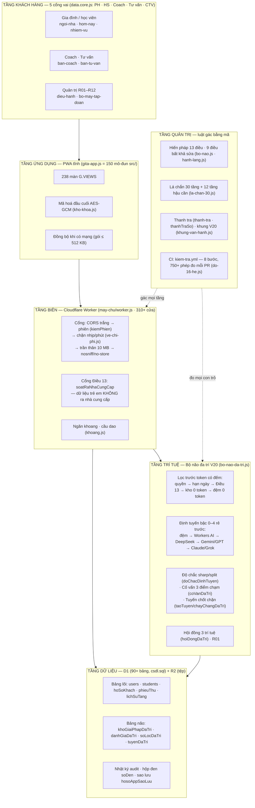
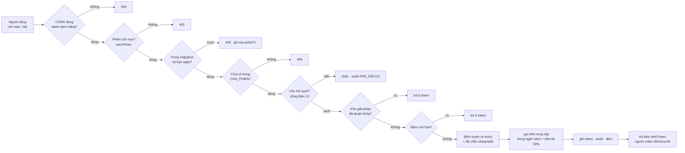
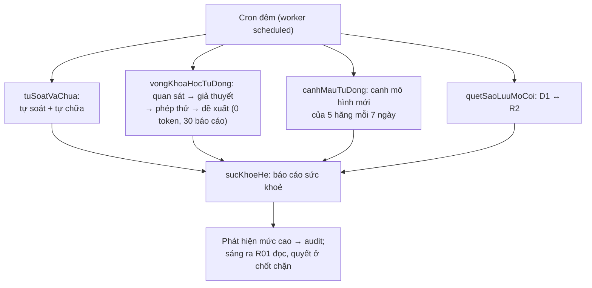
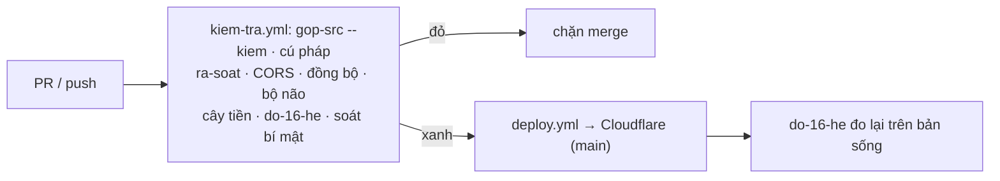

# Sơ đồ vận hành tổng thể GITA365

> Bản đồ đầy đủ của hệ: từ ngón tay khách hàng tới cơ sở dữ liệu, vòng đời một yêu cầu, vòng đêm tự vận hành, và vòng CI mỗi lần đổi mã. Mọi khối trong sơ đồ là mã THẬT — tên trong ngoặc là tệp/cửa/bảng tra được trong repo. Màn sống: `bo-may-tap-doan` (16 ban) · `he-16` (16 hệ) · `la-chan-30` (lá chắn) · `bo-nao-da-tri` (bộ não V20).

## 1. Toàn cảnh sáu tầng

## 2. Bộ máy 16 ban ↔ 16 hệ thống

Mỗi ban là một cửa sổ trỏ vào hệ thật; mỗi hệ có SOP, trần tự chủ và KPI đọc từ sổ audit.

| Ban (bo-may-tap-doan) | Hệ tương ứng (he-16) | Trỏ vào |
|---|---|---|
| B01 Thanh tra | H01 Quản trị | `thanh-tra` · `giam-sat` · `thanhTraSo` |
| B02 Sản xuất nội dung | H06 Marketing | `xuong-phim` · `baiNoiDung` · `kyNoiDung` |
| B03 Kho tài liệu | H02 Dữ liệu | `kho-tai-lieu` · `duyet-tai-lieu` · `tailieu` |
| B04 Giải pháp khách hàng | H12 Giải pháp | `ban-tu-van` · kho giải pháp đa trí |
| B05 Chuyên gia Coach | H04 Khách hàng | `ban-coach` · `diem-cham-1000` · `chuoi-wow` |
| B06 Chuyên gia Giáo dục | H04 Khách hàng | `lo-trinh` · `kpi-100` |
| B07 Luật sư — Pháp lý | H07 Pháp lý | `ra-soat-phap-ly` · `bang-chung` · `ky-ket` |
| B08 Dự án | H03 Vận hành | `bang-viec` · tuyến chốt chặn V20 |
| B09 Bộ não V20 | H09 Bộ não | `bo-nao-da-tri` |
| B10 Lá chắn & hậu cần | H15 Mã nguồn | `la-chan-30` · `do-16-he.js` |
| B11 Tài chính — Kế toán | H05 Tài chính | `phong-tai-chinh` · `ke-toan-thue` · `ghiPhieuThu` |
| B12 Marketing — Truyền thông | H06 Marketing | `noi-dung-tiep-thi` · `bien-soan-noi-dung` |
| B13 Nhân sự | H03 Vận hành | `bangLuong` · roster 100 trợ lý |
| B14 Chăm sóc khách hàng | H04 Khách hàng | `crm` · `crmKhach` · `soCham` |
| B15 Nghiên cứu & X10 | H13 R&D | `cai-tien` · `ban-do-chien-luoc` |
| B16 Đối tác & Thuê ngoài | H11 Thuê ngoài | `ket-noi` · `phimGuiViec` |

## 3. Vòng đời một yêu cầu (request lifecycle)

## 4. Vòng đêm tự vận hành (cron scheduled)

## 5. Vòng đổi mã (CI/CD)

## 6. Cây tiền — ba đích đo lúc đọc

| Chỉ số | Đích | Nguồn bảng | Cửa |
|---|---|---|---|
| Hài lòng (proxy không-xấu) | 90% | hoanTien · crmKhach · hoSoKhach | `docKpiCayTien` |
| Tái dùng + nâng cấp | 90% | phieuThu · lichSuTang | `docKpiCayTien` |
| Đạt tầng 5 | 20% | hoSoKhach.tang | `docKpiCayTien` |

## Chỗ còn thiếu (ghi thật)

1. Khảo sát hài lòng trực tiếp (CSAT) — "hài lòng" đang là proxy.
2. Lịch sản xuất nội dung tự xếp theo kỳ (B02) — hiện xếp tay.
3. Luật sư thật ký kết luận tuân thủ (B07).
4. Gantt/nguồn lực cho dự án (B08) — hiện qua bảng công việc + tuyến chốt chặn.
5. Màn tuyển dụng/hồ sơ nhân sự riêng (B13) — hiện qua bảng lương + roster.
6. Quy kết kênh marketing đem khách thật (B12) mà không theo dõi cá nhân.
7. Pentest độc lập · WAF/Bot Fight (bật trên Cloudflare) · diễn tập khôi phục định kỳ (xem LA_CHAN_30_TANG.md).
