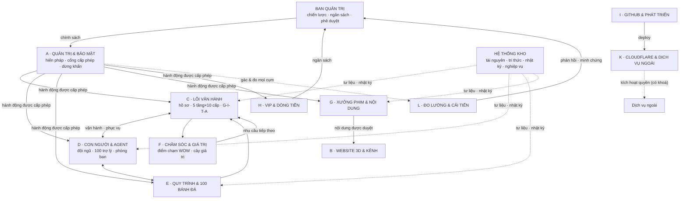
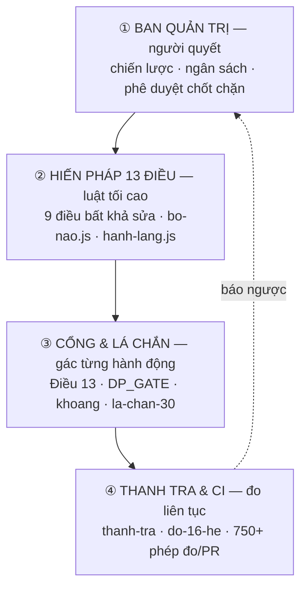

# GITA 365 — Sổ tay vận hành bài bản

> **Tệp này là gì.** Bản phân tích chiều sâu toàn hệ + hệ thống vận hành + quy
> trình chuẩn (SOP) + chỉ dẫn bài bản, dựng từ sơ đồ 13 cụm và **đo thẳng từ mã**
> trong repo. Mọi khối trỏ vào tệp/cửa/bảng thật — đúng luật của hệ: **đo, không khai**.
>
> **Đọc cùng:** [KIEN_TRUC_TONG_THE.md](KIEN_TRUC_TONG_THE.md) (as-built) ·
> [SO_DO_VAN_HANH_TONG_THE.md](SO_DO_VAN_HANH_TONG_THE.md) (vòng đời/đêm/CI) ·
> [KIEN_TRUC_NOI_LUC.md](KIEN_TRUC_NOI_LUC.md) (7 lớp phòng thủ) ·
> [HE_16_TRU.md](HE_16_TRU.md) (16 hệ · tự chủ TC0–TC5) ·
> [BANH-DA-VA-TANG-CAP.md](BANH-DA-VA-TANG-CAP.md) (100 bánh đà · 50 cấp).

---

# PHẦN I · PHÂN TÍCH CHIỀU SÂU HỆ THỐNG

## 1. Hệ thực sự là gì — bốn nguồn, sáu tầng

GITA 365 **không** là một ứng dụng đơn. Nó là một **hệ sinh thái tự vận hành** đặt
trên **bốn nguồn sự thật**, mỗi nguồn một việc, không chồng vai:

| Nguồn | Giữ gì | Vì sao |
|---|---|---|
| **GitHub** | Toàn bộ mã · CI 9 bước · deploy | Nguồn sự thật duy nhất của mã; mọi thay đổi qua PR có cổng đo |
| **Cloudflare** | Toàn bộ phần chạy: Pages (tĩnh) · Worker (311 cửa) · D1 (93 bảng) · R2 (ruột hồ sơ) · cron 2 nhịp | Một nhà cung cấp, một hoá đơn; D1 cùng cỗ máy nên test chạy thật; Pages cùng tên miền nên không CORS |
| **Web app (PWA)** | 231 màn · 5 cổng vai · E2EE · chạy offline | Khoá giải mã ở máy khách — máy chủ chỉ giữ bản đã mã hoá |
| **Google Drive Học viện** | Tài liệu nguồn · minh chứng · sách gốc · kịch bản | Đã ở đó, chạy tốt; app **trỏ**, không chép nội dung vào repo |

Chồng lên bốn nguồn là **sáu tầng vận hành** (xem sơ đồ §1 của
SO_DO_VAN_HANH_TONG_THE.md): **Khách hàng → Ứng dụng → Biên (Worker) → Trí tuệ
(Bộ não V20) → Dữ liệu (D1+R2) → Quản trị (luật gác bằng mã)**. Tầng Quản trị
không nằm trong luồng — nó **gác mọi tầng** và **đo mọi con trỏ**.

**Con số as-built (đếm từ mã):** 188 mô-đun `src/` · 231 màn · 74 mô-đun
`may-chu/` · 311 cửa Worker · 93 bảng D1 · 21 công cụ CI.

## 2. Đọc sơ đồ 13 cụm — mỗi cụm trỏ vào đâu

Sơ đồ bạn gửi gom hệ thành **13 cụm**. Dưới đây là bản dịch sang cơ chế thật:
cụm là **góc nhìn**, nguồn sự thật mới là **nơi chạy**.

| Cụm | Vai trò | Nguồn sự thật (tệp/cửa/bảng) | Hệ (H) / Ban (B) |
|---|---|---|---|
| **BAN QUẢN TRỊ** | Chiến lược · mục tiêu · chính sách · ngân sách · phê duyệt · giám sát | `bo-may-tap-doan` (16 ban) · `ban-do-chien-luoc` · KPI cây tiền | Trên cùng |
| **A · Quản trị & Bảo mật** | Danh tính, phân quyền, hiến pháp, cổng cấp phép, bảo vệ, dừng khẩn | `vai-tro.js` (R01–R20) · `bo-nao.js` (Hiến pháp 13 điều) · `an-toan-ai.js` (Điều 13) · `khoang.js` · `cuu-he.js` · `la-chan-30.js` | H01·H07 / B01·B07 |
| **B · Website 3D & Kênh** | Kênh social, cổng web 3D, 4 không gian vai | PWA `index.html`+`gita-app.js` · 5 cổng vai `data.core.js` · `noi-dung-tiep-thi.js` | H06 / B12 |
| **C · Lõi vận hành GITA** | Hồ sơ thống nhất · 5 tầng × 10 cấp · GITA CORE (G-I-T-A) · ma trận đa tầng | `hoSoKhach`·`users`·`students` · `hanh-trinh-5-tang.js` · `data.core.js` · `TANG_CAP` | H04 / B05·B06 |
| **D · Con người, Phòng ban & Agent** | Đội ngũ, 6 Agent trưởng, phòng ban, phân công/chuyển cấp | `vai-tro.js` · `dieu-phoi.js` (100 trợ lý · 29 miền · `DP_TRO_LY`) · 16 ban | H03·H08·H13 / B13 |
| **E · Quy trình & 100 bánh đà** | Quy trình chuẩn + 10 bánh đà × 10 việc nhỏ | `banh-da.js` (`BD_LON`·`BD_CAP`) · [BANH-DA-VA-TANG-CAP.md](BANH-DA-VA-TANG-CAP.md) | H03 |
| **F · Hướng dẫn, Chăm sóc & Giá trị** | Điểm chạm WOW, hướng dẫn theo tầng, cây giá trị | `diem-cham-1000` · `chuoi-wow` · `CWOW_LUAT` · `cay-tien-vip.js` | H04·H12 / B05·B14 |
| **G · Xưởng phim & Nội dung** | Đề xuất → duyệt → thiết kế cảnh → làm mới → sản xuất | `xuong-phim*.js` · `phim-0d.js` · `studio.js` · `duyet-tai-lieu` · `phim-cau-noi.js` (50 cấp) | H06 / B02 |
| **H · VIP & Dòng tiền** | Sản phẩm/quyền lợi · đơn & hợp đồng · đối soát · cây tiền VIP · ngân sách | `tai-chinh.js`·`ke-toan.js`·`ngan-hang.js` (webhook) · `phieuThu` · `cay-tien.js`·`cay-tien-vip.js` | H05 / B11 |
| **I · GitHub & Phát triển** | Repo · kiểm thử & bảo mật · phát hành Dev→Staging→Prod | `kiem-tra.yml` (9 bước) · `codeql.yml`·`scorecard.yml` · `do-16-he.js` · `deploy.yml` | H15 / B10 |
| **K · Cloudflare, Máy nối bộ & Dịch vụ ngoài** | Khôi phục · GPU render · adapter dịch vụ ngoài · CF (D1·R2·Workers) | `wrangler.toml` · D1 Time Travel · Windows 11 Pro GPU · `thu.js`·`phim-ai.js`·`ngan-hang.js` · 5 bộ não AI | H02·H11·H16 / B16 |
| **L · Đo lường & Cải tiến** | Logs·Metrics·Traces · vòng cải tiến · dashboard | Workers Logs · Web Analytics · audit · `cai-tien.js` · `do-16-he.js` · `suc-khoe.json` | H13 / B15 |
| **HỆ THỐNG KHO** | Kho tài nguyên sản xuất · tri thức & hướng dẫn · nhật ký & phục hồi · nghiệp vụ | `assets/`·`kho/*.enc` · `kho-tai-lieu` · audit·`soDen`·sao lưu · bảng D1 nghiệp vụ | H02 / B03 |

## 3. Mạch máu — các luồng chính nối 13 cụm

Sơ đồ không phải 13 hộp rời; nó là **một vòng tuần hoàn**. Năm mạch chính:

1. **Mạch quản trị (trên xuống):** Ban quản trị phát *chiến lược · ngân sách ·
   phê duyệt* xuống C/D/E/F/G/H. Mọi hành động đi xuống đều **qua cụm A** (cổng
   cấp phép) — "hành động được cấp phép" là nhãn trên mũi tên.
2. **Mạch phục vụ (lõi quay):** C (lõi) ↔ D (con người/agent) ↔ E (quy trình) —
   *vận hành · phục vụ*. Đây là bánh đà trung tâm: hồ sơ → tầng/cấp → bánh đà →
   agent/phòng ban thực thi.
3. **Mạch giá trị (ra khách):** C/E → F (chăm sóc, điểm chạm) → *nhu cầu tiếp
   theo* vòng lại C; G (nội dung được duyệt) → B (kênh) ra ngoài.
4. **Mạch dòng tiền:** H nhận *đánh giá theo tiêu chí* và *đối soát*, phát
   *ngân sách* nuôi mọi cụm; cây tiền VIP là đòn bẩy nguồn lực.
5. **Mạch nội lực (nền đỡ):** I (phát triển) → K (hạ tầng, deploy) nuôi phần
   chạy; K *kích hoạt quyền dịch vụ* ra ngoài **chỉ khi có khoá**; Kho phục vụ
   *tư liệu · tài nguyên · nhật ký* cho tất cả; L đo mọi thứ rồi *phản hồi +
   minh chứng* ngược lên Ban quản trị để cải tiến.

## 4. Bảy nguyên tắc kiến trúc đang chạy (rút từ mã)

1. **Một cửa vào, một nguồn sự thật** — mọi yêu cầu qua `worker.js`; mọi đổi mã qua PR có CI.
2. **Đo, không khai** — 750+ phép đo CI mỗi PR; KPI tính lúc đọc từ D1; con trỏ chết thì CI đỏ.
3. **Rẻ trước, 0đ mặc định** — kho giải pháp + đệm trả 0 token; AI bậc cao chỉ khi cần và có ngân sách; trần tải 50%.
4. **Máy đề xuất, người quyết (AT5)** — cố vấn chỉ khuyên; vòng nhà khoa học chỉ báo; tuyến chốt chặn dừng chờ người.
5. **Không bí mật trong repo** — secret nạp qua `wrangler secret`/Actions; CI có bước soát bí mật.
6. **Bản sao kép** — Pages + GitHub Pages mirror; sao lưu R2 theo người; điểm khôi phục kiểm được.
7. **Đổi nền đổi ngược được trong một phút** — cửa vào mới giữ nguyên bề mặt máy chủ cũ; `wrangler rollback` là phao.

---

# PHẦN II · HỆ THỐNG VẬN HÀNH (OPERATING MODEL)

## 5. Quản trị bốn lớp — luật gác bằng mã

Vận hành GITA 365 được giữ bởi **bốn lớp quản trị**, xếp từ ý chí xuống thực thi:

**Nguyên tắc xuyên suốt — "Máy đề xuất, Người quyết" (thang tự chủ TC0–TC5):**

| Bậc | Nghĩa | Trần theo hồ sơ cửa |
|---|---|---|
| TC0–TC1 | Người làm · AI gợi ý | — |
| TC2 | AI soạn, **người ký** | `tien`, `con` (tiền, trẻ em) |
| TC3 | AI làm, **người duyệt mẫu / ba chữ ký** | `duyet3`, `ngoai` |
| TC4 | AI tự chạy trọn, có nhật ký + hoàn tác | `chung` |
| TC5 | AI tự đổi luật | **không bao giờ mở** cho tiền, trẻ em, khách hàng |

Số đo hiện tại (`node tools/do-16-he.js`): **TC4 = 27 cửa · TC3 = 24 · TC2 = 49 / 100**.
Điểm khác biệt không phải "AI làm hết" mà là **chứng minh được AI làm tới đâu,
người ký ở đâu**.

## 6. Vai & quyền — ai được làm gì

- **15 vai trải nghiệm (R01–R15)** + 4 chuyên gia phản biện + dải quản trị tới R20
  (`vai-tro.js`, `data.core.js`). Quyền theo **vai × tầng được cấp phép**.
- **Quyền tối thiểu:** mỗi vai chỉ thấy cửa trong phạm vi của mình; kho mã hoá chỉ
  mở cho tài khoản đúng vai + đúng tầng (AES-256-GCM, `kho-khoa.js`).
- **MFA cho quản trị · ba chữ ký** cho hành động `duyet3`; **thu hồi quyền** tức thời.
- **Khoang `cua` (đăng nhập) và `cuuhe` không bao giờ khoá được từ trong app** —
  để không tự nhốt mình ở ngoài.

## 7. Xương sống 16 ban ↔ 16 hệ

Mỗi **ban** là cửa sổ quản trị; mỗi **hệ** là cơ chế chạy thật có **SOP · trần tự
chủ · KPI đọc từ sổ audit**. CI đỏ nếu một con trỏ chết.

| Ban | Hệ | Trỏ vào |
|---|---|---|
| B01 Thanh tra | H01 Quản trị | `thanh-tra`·`giam-sat`·`thanhTraSo` |
| B02 Sản xuất nội dung | H06 Marketing | `xuong-phim`·`baiNoiDung`·`kyNoiDung` |
| B03 Kho tài liệu | H02 Dữ liệu | `kho-tai-lieu`·`duyet-tai-lieu`·`tailieu` |
| B04 Giải pháp khách hàng | H12 Giải pháp | `ban-tu-van`· kho giải pháp đa trí |
| B05 Chuyên gia Coach | H04 Khách hàng | `ban-coach`·`diem-cham-1000`·`chuoi-wow` |
| B06 Chuyên gia Giáo dục | H04 Khách hàng | `lo-trinh`·`kpi-100` |
| B07 Luật sư — Pháp lý | H07 Pháp lý | `ra-soat-phap-ly`·`bang-chung`·`ky-ket` |
| B08 Dự án | H03 Vận hành | `bang-viec`· tuyến chốt chặn V20 |
| B09 Bộ não V20 | H09 Bộ não | `bo-nao-da-tri` |
| B10 Lá chắn & hậu cần | H15 Mã nguồn | `la-chan-30`·`do-16-he.js` |
| B11 Tài chính — Kế toán | H05 Tài chính | `phong-tai-chinh`·`ke-toan-thue`·`ghiPhieuThu` |
| B12 Marketing — Truyền thông | H06 Marketing | `noi-dung-tiep-thi`·`bien-soan-noi-dung` |
| B13 Nhân sự | H03 Vận hành | `bangLuong`· roster 100 trợ lý |
| B14 Chăm sóc khách hàng | H04 Khách hàng | `crm`·`crmKhach`·`soCham` |
| B15 Nghiên cứu & X10 | H13 R&D | `cai-tien`·`ban-do-chien-luoc` |
| B16 Đối tác & Thuê ngoài | H11 Thuê ngoài | `ket-noi`·`phimGuiViec` |

## 8. Bộ não V20 & 100 trợ lý — trí tuệ có gác

- **Lọc trước token:** quyền → hạn ngày → Điều 13 → kho 0 token → đệm 0 token.
- **Định tuyến rẻ trước (bậc 0–4):** đệm → Workers AI → DeepSeek → Gemini/GPT → Claude/Grok.
- **Độ chắc sharp/split · cố vấn 3 điểm chạm · tuyến chốt chặn · hội đồng 3 trí tuệ (R01).**
- **100 trợ lý · 29 miền (`DP_TRO_LY`)**, mỗi agent 8 năng lực (VT·NV·QT·KPI·TW·NC·BV·HP);
  29 SOP, mỗi SOP chỉ nối cửa của **chính miền đó** — CI kiểm.

---

# PHẦN III · QUY TRÌNH CHUẨN (SOP)

> Mỗi SOP có: **mục đích · người chịu trách nhiệm (RACI) · các bước · ngưỡng đỏ ·
> bằng chứng để lại**. RACI: **R** làm · **A** chịu trách nhiệm cuối · **C** hỏi
> ý · **I** báo tin.

## SOP-01 · Vòng đời một yêu cầu
**Mục đích:** mọi lượt gọi đều qua đúng cổng, rẻ trước, có audit.
**RACI:** A = Bộ não V20 (máy) · A-người = Admin trực.
**Các bước (máy tự chạy):** CORS trắng → `kiemPhien` (phiên) → chặn nhịp/phút +
hạn ngày → cửa có trong `CAN_PHIEN`? → cổng Điều 13 (câu hỏi sạch?) → kho giải
pháp khớp? *(trả 0 token)* → đệm còn hạn? *(0 token)* → định tuyến rẻ trước trong
ngân sách + trần tải 50% → ghi token·audit·đệm → trả kèm `dinhTuyen`.
**Ngưỡng đỏ:** 429 tăng đột biến (dò quét) → bật Rate Limiting binding; chi phí AI
tăng → `GITA_CHE_DO_TIET_KIEM=1`.
**Bằng chứng:** `soLocDaTri`, nhật ký audit, `x-gita-ma`.

## SOP-02 · Onboarding gia đình/học viên (lõi C + E)
**Mục đích:** đưa một nhà vào đúng tầng, mở bánh đà bằng bằng chứng.
**RACI:** R = Coach (B05) · A = Chuyên gia Giáo dục (B06) · C = Tư vấn · I = CSKH (B14).
**Các bước:**
1. Lập **hồ sơ thống nhất** (`hoSoKhach`): chân dung nhà mình, định vị, nỗi đau → khát khao.
2. Định tầng khởi điểm trong **5 tầng × 10 cấp** (`hanh-trinh-5-tang` · `TANG_CAP`).
3. Mở **Bánh đà 1 — Sổ tối ba dòng** (`BD_LON[0]`): giao **đúng một việc nhỏ**.
4. Dựng bảng số chung; hẹn buổi đọc lại tuần.
5. Mỗi mốc mở **bằng bằng chứng nhà tự ghi**, không bằng nút bấm (Luật 1, `banh-da.js`).
**Ngưỡng đỏ:** 3 tối liền sổ trống → CSKH chạm nhẹ (không thúc, `CWOW_LUAT`).
**Bằng chứng:** `journal`, `chotKhNgay`, `test`, `lichSuTang`.

## SOP-03 · Một ngày vận hành (nhịp ngày)
**RACI:** R = Admin trực · A = Super Admin · I = Ban quản trị.
**Sáng:** đọc **Báo cáo tự chữa** + **sức khoẻ hệ** (`suc-khoe.json`) + bản tổng
doanh thu hôm qua (cron 07:00). Quyết ở **chốt chặn** nếu vòng đêm nêu mức cao.
**Trong ngày:** theo dõi hàng đợi duyệt (nội dung, tài liệu, hợp đồng); trả lời
tuyến chốt chặn V20; giữ hàng đợi CSKH.
**Chiều:** đối soát phiếu thu mới; soát điểm chạm WOW đến hạn.
**Ngưỡng đỏ:** `SUC_KHOE_HE` trong log · khoang tự ngắt lặp lại · 429 bất thường.

## SOP-04 · Chăm sóc & điểm chạm WOW (cụm F)
**RACI:** R = CSKH (B14) + Coach (B05) · A = Chuyên gia Coach · C = Bộ soát đạo đức.
**Các bước:** đọc nhu cầu từ hồ sơ → chọn điểm chạm theo tầng (`diem-cham-1000`,
`chuoi-wow`) → **mọi kịch bản qua `pcnSoatDaoDuc`** (cấm "chỉ còn", "kẻo lỡ",
"chia sẻ ngay"…) → phát đúng thời khắc → ghi phản hồi → vòng *nhu cầu tiếp theo* về C.
**Ngưỡng đỏ:** kịch bản vi phạm `CWOW_LUAT` → chặn, không phát.

## SOP-05 · Sản xuất nội dung / Xưởng phim (cụm G)
**RACI:** R = Đội nội dung (B02) · A = Super Admin duyệt · C = B12 Marketing.
**Các bước:** đề xuất sản xuất (nhu cầu·kịch bản·dự toán) → thiết kế cảnh → làm mới
(`phim-ai`/fal.ai hoặc GPU nội bộ `phim-0d`) → sản xuất nội bộ (`xuong-phim-bo`) →
**quản trị duyệt** (`duyet-tai-lieu`, có hạn mức·giờ·lịch·lưới sửa) → *nội dung được
duyệt* đẩy sang **B (kênh)**. Phim cầu nối 50 cấp (`phim-cau-noi.js`) qua bộ soát đạo đức.
**Ngưỡng đỏ:** tỉ lệ lỗi khoang `phim` cao → tách sang Queues (lộ trình); nội dung
chưa duyệt **không** ra kênh.

## SOP-06 · VIP & Dòng tiền (cụm H)
**RACI:** R = Tài chính–Kế toán (B11) · A = Super Admin · C = Luật sư (B07) cho hợp đồng.
**Các bước:** sản phẩm & quyền lợi → đơn & **ký kết** (`ky-ket`, bằng chứng) → thu
tiền → **đối soát** webhook sao kê ngân hàng (`ngan-hang.js`, khoá riêng, mở đúng 1
việc) → ghi `phieuThu` → cập `lichSuTang` → **CÂY TIỀN VIP** (`cay-tien-vip`) làm đòn
bẩy nguồn lực → phát *ngân sách* cho các cụm.
**Ngưỡng đỏ:** lệch đối soát → dừng, soát tay; chi tiêu vượt ngân sách cửa → chốt chặn.
**Chi phí 0/20/50:** 0đ < 300k tài khoản · ≤ 20 USD 300k–500k · ≤ 50 USD > 500k.

## SOP-07 · Phát triển & phát hành (cụm I)
**RACI:** R = Kỹ thuật · A = Super Admin · C = CODEOWNERS.
**Các bước:**
1. Nhánh riêng → commit theo Conventional Commits (`feat|fix|docs|chore(phạm-vi): …`).
2. PR → **`kiem-tra.yml` (9 bước)**: gộp src · cú pháp Worker · rà soát · CORS · đồng
   bộ · bộ não · cây tiền · `do-16-he` (750+ phép đo) · soát bí mật. **Đỏ → chặn merge.**
3. Thêm cổng `codeql.yml`·`scorecard.yml`·Dependabot·branch protection cho `main`.
4. Merge → **`deploy.yml`**: gate cú pháp → nạp thử Worker → deploy Worker → gọi thử
   sức khoẻ → build bundle → deploy Pages → mirror GitHub Pages.
5. `do-16-he` đo lại trên bản sống.
**Ngưỡng đỏ:** deploy hỏng → **`wrangler rollback`**; bản GitHub Pages là phao.

## SOP-08 · Hạ tầng & dịch vụ ngoài (cụm K)
**RACI:** R = Kỹ thuật · A = Super Admin.
**Các bước:** CF là nền (D1·R2·Workers·cron); **máy nối bộ GITA** (Windows 11 Pro
GPU) cho render phim 0đ; **dịch vụ ngoài qua adapter, chỉ chạy khi có khoá**
(`kích hoạt quyền dịch vụ`): 5 bộ não AI · thư Resend/Gmail · fal.ai · webhook ngân
hàng. Secret nạp qua `wrangler secret`/Actions.
**Ngưỡng đỏ:** dịch vụ ngoài hết hạn mức → về đệm/kho 0 token; cầu nối Gmail
~100 người nhận/ngày → chuyển Resend + tên miền riêng trước khi vượt vài nghìn tài khoản.

## SOP-09 · Vòng đêm tự vận hành (cron 03:00 VN)
**RACI:** A = máy; A-người = Admin đọc sáng hôm sau.
**Máy chạy:** `tuSoatVaChua` (tự soát + chữa, nhịp tim D1/R2, soát 200 hồ sơ/đêm,
mở khoang hết hạn) · `vongKhoaHocTuDong` (quan sát → giả thuyết → phép thử → đề
xuất, 0 token, 30 báo cáo) · `canhMauTuDong` (canh mô hình mới 5 hãng mỗi 7 ngày)
· `quetSaoLuuMoCoi` (D1 ↔ R2) → gộp `sucKhoeHe` → ghi `he-thong/suc-khoe.json`.
Cron 07:00: bản tổng doanh thu hôm qua.
**Chốt:** phát hiện mức cao → audit; **sáng ra R01 đọc, quyết ở chốt chặn** (máy
không tự đổi luật — TC5 đóng).

## SOP-10 · Sự cố — 5 bước
1. Nhìn **Báo cáo tự chữa** + Workers Metrics.
2. **Khoá đúng khoang** có vấn đề (nút ở màn *Khoang hệ thống & sức khoẻ*, hoặc
   `GITA_KHOA_KHOANG="ai,phim"`). 12 khoang; `cua`/`cuuhe` không khoá được.
3. Chi phí AI tăng → `GITA_CHE_DO_TIET_KIEM=1`.
4. Lấy `x-gita-ma` từ người dùng → `wrangler tail`.
5. Sửa → PR → cổng kiểm → deploy → **mở khoang**. Mọi bước có nhật ký.

## SOP-11 · Sao lưu & khôi phục (DR)
| Rủi ro | Cách khôi phục | Chi phí |
|---|---|---|
| Xoá/ghi hỏng D1 | **D1 Time Travel** `wrangler d1 time-travel restore` | 0 |
| Hỏng nhiều hồ sơ R2 | bản gzip `hoso-sao/` + tự chữa | 0 |
| Mất tài khoản CF | **sao lưu offline Windows 11 Pro** (`sao-luu.ps1` 02:30, BitLocker) | 0 |
| Worker sập | bản tĩnh GitHub Pages vẫn chạy | 0 |
| Deploy hỏng | cổng kiểm + `wrangler rollback` | 0 |

Token wrangler máy sao lưu = **D1 Read**; khoá R2 rclone = **Object Read**. **Mỗi quý
thử khôi phục một lần** vào D1 thử.

## SOP-12 · Đo lường & cải tiến (cụm L + R&D)
**RACI:** R = B15 Nghiên cứu · A = Ban quản trị · I = toàn hệ.
**Các bước:** thu Logs·Metrics·Traces (Workers Logs, Web Analytics, audit) →
dashboard (`do-16-he`, KPI cây tiền) → vòng cải tiến (`cai-tien`) → **R&D chu kỳ 6
tháng**: tháng 0 chụp **mốc nền** (`h16ChupMoc`), tháng 1–5 thử, tháng 6 so tỉ số
thật/mốc nền. Chiến lược chỉ "chứng" khi có bằng chứng đo được gắn kèm (ICE).

### Cây tiền — ba đích đo lúc đọc
| Chỉ số | Đích | Nguồn | Cửa |
|---|---|---|---|
| Hài lòng (proxy không-xấu) | 90% | `hoanTien`·`crmKhach`·`hoSoKhach` | `docKpiCayTien` |
| Tái dùng + nâng cấp | 90% | `phieuThu`·`lichSuTang` | `docKpiCayTien` |
| Đạt tầng 5 | 20% | `hoSoKhach.tang` | `docKpiCayTien` |

---

# PHẦN IV · CHỈ DẪN BÀI BẢN (NHỊP & DANH SÁCH KIỂM)

## 9. Nhịp vận hành — ngày / tuần / tháng / quý

| Nhịp | Việc | Ai (A) | Bằng chứng |
|---|---|---|---|
| **Ngày** | Đọc báo cáo tự chữa + sức khoẻ + doanh thu; giải hàng đợi duyệt; trả tuyến chốt chặn; giữ CSKH | Admin trực | `suc-khoe.json`, audit |
| **Tuần** | Buổi nhìn lại nhịp; soát điểm chạm WOW; soát hàng đợi nội dung; đối soát tài chính tuần | Trưởng ban liên quan | KPI cây tiền |
| **Tháng** | Soát 16 ban (SOP·trần·KPI); soát vai & khoang; bản tổng tài chính; cập 1000 chiến lược (ICE) | Super Admin | `do-16-he`, `ban-do-chien-luoc` |
| **Quý** | **Thử khôi phục DR** 1 lần; rà pentest/WAF/Bot Fight; soát mốc nền R&D; rà khoảng trống (Phần V) | Ban quản trị | biên bản DR, Scorecard |

## 10. Bảy ngày đầu của Admin mới
1. Đọc 5 tài liệu kiến trúc (đầu tệp này) + chạy `node tools/do-16-he.js`.
2. Đăng nhập đủ 5 cổng vai, đi hết 12 màn nguy nhất.
3. Tập **khoá/mở một khoang** thử (không phải `cua`/`cuuhe`).
4. Chạy một PR nhỏ qua CI 9 bước; xem cổng đỏ chặn ra sao.
5. Diễn tập **SOP-10 sự cố** trên môi trường thử.
6. Đọc KPI cây tiền + báo cáo sức khoẻ, hiểu ngưỡng đỏ.
7. Thử một lần **SOP-11 khôi phục** vào D1 thử.

## 11. Bảng ngưỡng đỏ (khi nào báo động)
| Tín hiệu | Nơi thấy | Hành động |
|---|---|---|
| `SUC_KHOE_HE` | Workers Logs / báo cáo | SOP-10 bước 1–2 |
| Khoang tự ngắt lặp lại | log `KHOANG_TU_NGAT` | khoá khoang, soi nguyên nhân |
| 429 tăng vọt | audit `soLocDaTri` | bật Rate Limiting binding |
| Chi phí AI tăng | dashboard chi phí | `GITA_CHE_DO_TIET_KIEM=1` |
| Lệch đối soát tài chính | B11 | dừng, soát tay, chốt chặn |
| CI đỏ ở `do-16-he` | PR | con trỏ chết — sửa trước merge |
| Deploy hỏng | `deploy.yml` | `wrangler rollback` |

## 12. Ma trận RACI tổng (rút gọn)
| Quy trình | R | A | C | I |
|---|---|---|---|---|
| Onboarding (SOP-02) | Coach B05 | Giáo dục B06 | Tư vấn | CSKH B14 |
| Chăm sóc WOW (SOP-04) | CSKH B14 | Coach B05 | Bộ soát đạo đức | Ban quản trị |
| Nội dung (SOP-05) | Nội dung B02 | Super Admin | Marketing B12 | Kênh B |
| Dòng tiền (SOP-06) | Tài chính B11 | Super Admin | Luật sư B07 | Ban quản trị |
| Phát hành (SOP-07) | Kỹ thuật | Super Admin | CODEOWNERS | toàn hệ |
| Sự cố (SOP-10) | Admin trực | Super Admin | Kỹ thuật | Ban quản trị |

---

# PHẦN V · KHOẢNG TRỐNG & LỘ TRÌNH (GHI THẬT)

> Giữ đúng tinh thần "đo, không khai": nêu thẳng chỗ chưa có + **ngưỡng kích hoạt**.

1. **CSAT trực tiếp chưa có** — "hài lòng" đang là proxy. *Kích hoạt:* khi đủ dữ
   liệu khách để khảo sát không theo dõi cá nhân.
2. **Workers AI binding + Rate Limiting binding** đang khai nhưng **chưa bật** (bỏ `#` khi cần).
3. **Thư qua cầu nối Gmail ~100 người/ngày** → sang **Resend + tên miền riêng**
   trước khi vượt vài nghìn tài khoản hoạt động.
4. **Drive phụ thuộc tài khoản Google Học viện** — chưa có dự phòng nếu mất quyền.
5. **Pentest độc lập · WAF/Bot Fight/Turnstile (bật tay CF) · diễn tập DR định kỳ** — xem [LA_CHAN_30_TANG.md](LA_CHAN_30_TANG.md).
6. **Lịch sản xuất nội dung tự xếp (B02)** — hiện xếp tay.
7. **Luật sư thật ký kết luận tuân thủ (B07)**; **Gantt/nguồn lực dự án (B08)**;
   **màn tuyển dụng/hồ sơ nhân sự (B13)**; **quy kết kênh marketing (B12)** — đều ở
   mức trỏ cơ chế hiện có, nâng khi chạm ngưỡng.
8. **Nâng cấp quanh 300k tài khoản:** D1 Time Travel 30 ngày · thông báo sức khoẻ
   chủ động qua Gmail · tách phim/AI nặng sang Queues nếu khoang `phim` lỗi cao.

---

## Tiếp nối
- Dữ liệu lõi cho cụm C/E: [BANH-DA-VA-TANG-CAP.md](BANH-DA-VA-TANG-CAP.md)
- Phòng thủ & tự chữa: [KIEN_TRUC_NOI_LUC.md](KIEN_TRUC_NOI_LUC.md) · [LA_CHAN_30_TANG.md](LA_CHAN_30_TANG.md)
- Tự chủ & 16 hệ: [HE_16_TRU.md](HE_16_TRU.md)
- Chi phí & sức chứa: [TOI_UU_CHI_PHI_CHAT_LUONG.md](TOI_UU_CHI_PHI_CHAT_LUONG.md)
